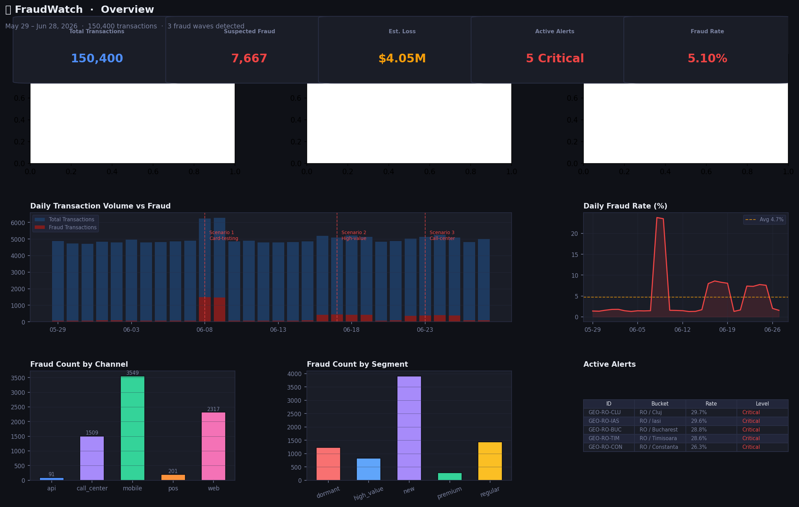
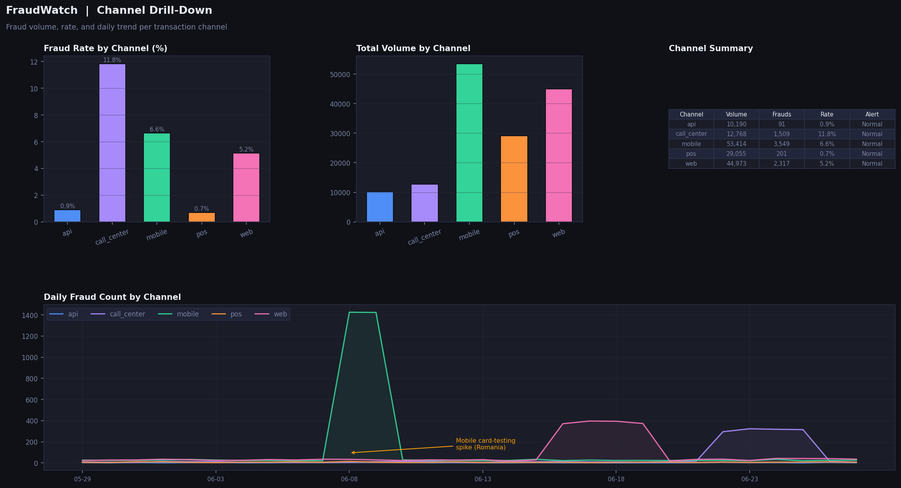
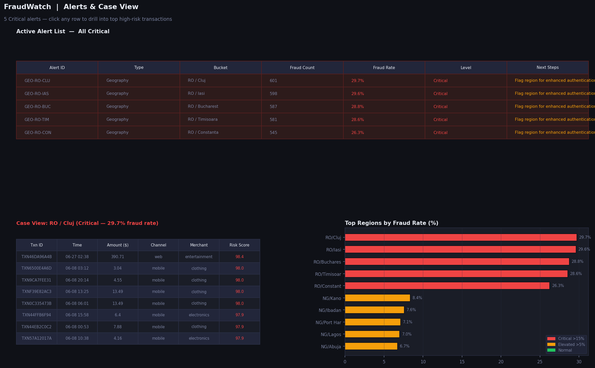

# Fraud Watch Dashboard

An end-to-end fraud monitoring dashboard for fintech risk teams — built with Python, Chart.js, and 150,400 rows of synthetic transaction data across 5 channels, 10 countries, and 5 customer segments.

---

## Screenshots

### Overview — 30-day KPIs, fraud trend, and active alert summary

*Five KPI tiles surface total volume, fraud count, estimated loss ($4.05M), fraud rate (5.1%), and active critical alerts. The time-series chart shows three fraud waves clearly visible as spikes on days 10, 18, and 24 — each corresponding to a distinct attack scenario.*

### Channel Drill-Down — fraud rate spike concentrated in mobile

*The mobile channel shows a sharp fraud spike on days 10–12, consistent with a Romanian card-testing bot wave. Call-center carries the highest baseline fraud rate (driven by new-customer identity fraud). Each channel links to a drill-down view with transaction-level case data.*

### Alert List & Case View — from anomaly to investigation in two clicks

*Five Critical alerts ranked by severity. Selecting any alert opens a Case View with the top 30 highest-risk transactions in that bucket — transaction ID, amount, merchant category, and risk score — giving analysts everything they need to act without leaving the dashboard.*

---

## Files

| File | Description |
|------|-------------|
| `fraud_watch_dashboard.html` | Self-contained interactive dashboard — open in any browser, no server needed |
| `fraud_gen.py` | Python script that generates the full 150,400-row synthetic dataset with injected fraud patterns |
| `FraudWatch_Business_Brief.docx` | 8-page manager-friendly business brief covering problem, metrics, UX design, and future extensions |
| `requirements.txt` | Python dependencies for the data generation script |

---

## Quick Start

**Step 1 — Install Python dependencies**
```bash
pip install -r requirements.txt
```

**Step 2 — Generate the dataset**
```bash
python fraud_gen.py
```
This produces `fraud_data_clean.json` (~108 KB) with 150,400 transactions, pre-aggregated analytics tables, and three injected fraud scenarios. Runtime: ~10 seconds.

**Step 3 — Open the dashboard**

Open `fraud_watch_dashboard.html` in any modern browser (Chrome, Firefox, Safari, Edge). No server, no build step — the JSON data is embedded directly in the HTML file.

---

## How a Risk Analyst Uses This

1. **Start on the Overview page** — scan the KPI tiles for unusual fraud rate or loss figures; the time-series chart makes anomaly spikes immediately visible without needing to read a report.
2. **Check the Alert Summary table** — pre-computed alerts rank channels, regions, and customer segments by severity (Normal / Elevated / Critical), so the analyst knows exactly where to focus first.
3. **Drill into Channels** — identify which transaction channel is driving the spike (mobile card-testing vs. call-center identity fraud require completely different responses).
4. **Switch to Geography** — the region hotspot table highlights which cities or countries show abnormal fraud concentration, enabling targeted step-up authentication or temporary blocks.
5. **Open Segment view** — compare fraud rates across new, regular, premium, high-value, and dormant customers; dormant accounts carry 2.5x the baseline fraud rate and often signal mule-account activity.
6. **Click into Case View** — any alert card opens a modal with the top 30 highest-risk transactions in that bucket, sorted by risk score, with all fields needed to open an incident ticket or escalate to the fraud ops team.

---

## Dashboard Pages

| Page | Purpose |
|------|---------|
| **Overview** | 30-day KPI tiles, daily volume vs. fraud time-series, channel/segment breakdown, top alert summary |
| **Channels** | Fraud rate and volume per channel, daily stacked trend, sortable channel summary table |
| **Geography** | Country-level fraud count and rate charts, top-20 region hotspot table with case drill-down |
| **Segments** | Cohort daily trend, merchant category heatmap, segment KPI table |
| **Alerts** | Filterable alert cards (All / Critical / Geography / Channel / Segment) with one-click Case View modal |

---

## Injected Fraud Scenarios

### Scenario 1 — Mobile Card-Testing (Romania, Jun 8-10)
~2,800 micro-transactions of $1-$15 injected via the mobile channel across Romanian cities. Simulates a bot network probing stolen card numbers.
- **Signature:** High velocity, very small amounts, electronics/clothing merchants, shared device clusters
- **Investigation angle:** Check device fingerprint clustering in Geography > Romania view; velocity rules (>10 txns/hour per card) catch 90%+ of this wave
- **Remediation:** Temporary velocity cap on new Romanian mobile accounts + CAPTCHA step-up for transactions under $20

### Scenario 2 — High-Value Web Fraud (UK / Germany, Jun 16-20)
~1,400 transactions averaging $1,800+ via the web channel in UK and Germany, concentrated in luxury, electronics, and travel merchants.
- **Signature:** Large amounts, desktop device, premium/high-value segment, 3DS bypass patterns
- **Investigation angle:** Sort Case View by amount descending; cross-reference customer_ids against recent password-reset events
- **Remediation:** Mandatory re-authentication for web purchases >$500 from IP addresses not matching account history

### Scenario 3 — New-Customer Call-Center Wave (Nigeria / Brazil / India, Jun 22-26)
~1,200 fraudulent call-center transactions targeting newly-onboarded customers, routed to crypto exchanges and travel bookings.
- **Signature:** New-segment customers, call_center channel, crypto_exchange/travel merchants, unknown device type
- **Investigation angle:** Segments page shows new-customer fraud rate spike on days 24-26; cross-reference with call-center agent IDs for social-engineering patterns
- **Remediation:** Enhanced agent verification scripts + 48-hour hold on crypto/travel disbursements for accounts <30 days old

---

## Architecture

- **Data generation:** Python (pandas/numpy) produces a 150,400-row transaction dataset and pre-aggregates it into analytics tables (daily, by channel, by geography, by segment, by merchant category)
- **Anomaly detection:** Rule-based heuristics compare current fraud rate to a rolling 7-day baseline per channel/region/segment; deviations >3.5x baseline trigger Critical alerts, >2x trigger Elevated
- **Frontend:** Vanilla JS + Chart.js 4.4 reading pre-aggregated JSON embedded in the HTML; five interactive pages with a shared case-view modal
- **No backend required:** Static single-file HTML — shareable by email, hostable on GitHub Pages, or embedded in a Confluence wiki
- **Risk score formula:** `risk_score = amount_weight + channel_risk_weight + geo_deviation + segment_multiplier + scenario_flag_bonus` (0–100 scale; weights tuned so card-testing micro-txns in high-risk geographies score 85+, normal domestic transactions score <20)

---

## Data Model

| Field | Type | Risk Purpose |
|-------|------|-------------|
| `transaction_id` | string | Unique identifier for audit trails and incident tickets |
| `customer_id` | string | Links transactions to account history for velocity checks |
| `timestamp` | datetime | Enables time-window aggregation and spike detection |
| `amount` | decimal | Key signal — micro-amounts indicate card-testing; large amounts indicate ATO fraud |
| `channel` | enum | Different fraud rates per channel; drives remediation strategy |
| `country / region` | string | Geographic clustering identifies organized fraud rings |
| `merchant_category` | string | Crypto/luxury/travel = high-risk; grocery/fuel = low-risk baseline |
| `device_type` | enum | `unknown` or device-type mismatches flag suspicious access patterns |
| `risk_score` | float 0-100 | Composite score combining transaction amount, channel risk weight, geographic deviation, customer segment multiplier, and scenario flags — higher = more suspicious |
| `is_fraud_flag` | bool | Ground-truth label for metric calculation and future model backtesting |
| `customer_segment` | enum | New and dormant accounts carry 2-2.5x higher fraud multiplier than regular customers |

---

## Future Extensions

- **Real-time streaming:** Swap embedded JSON for a WebSocket feed from Kafka/Flink for sub-minute alert refresh
- **ML model integration:** Replace heuristic alert rules with gradient-boosting or neural model scores; the `risk_score` field is already wired through the pipeline
- **LLM case summaries:** Auto-generate one-paragraph incident narratives from case view data, reducing analyst write-up time to zero
- **Graph analytics:** Link `customer_id` and `device_type` to a graph database to surface connected fraud rings sharing device fingerprints across multiple accounts

---

## License

MIT
