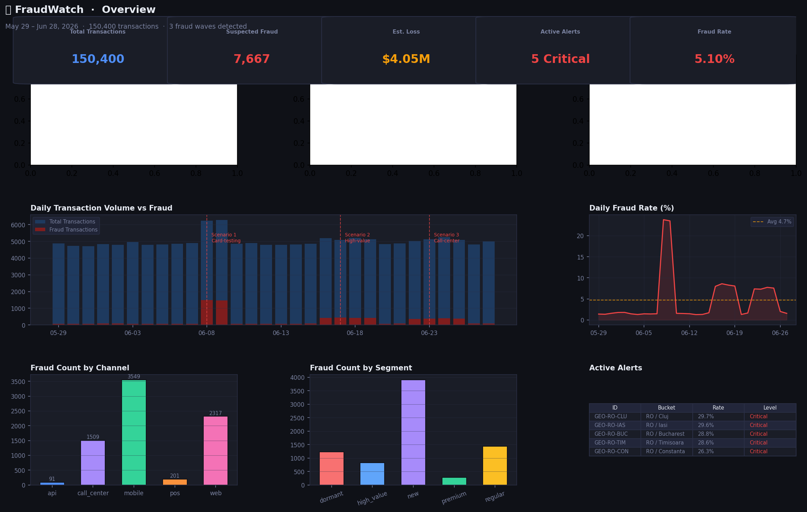
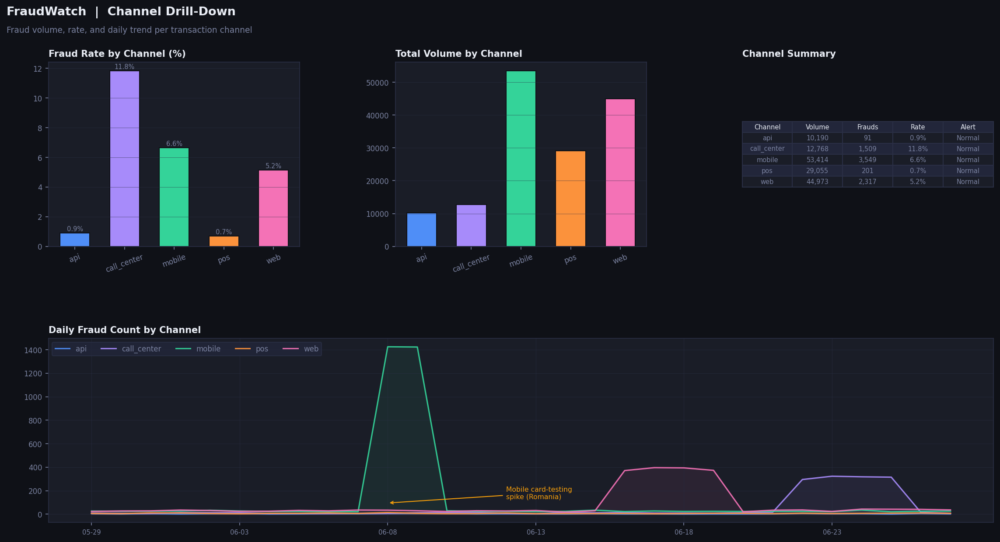
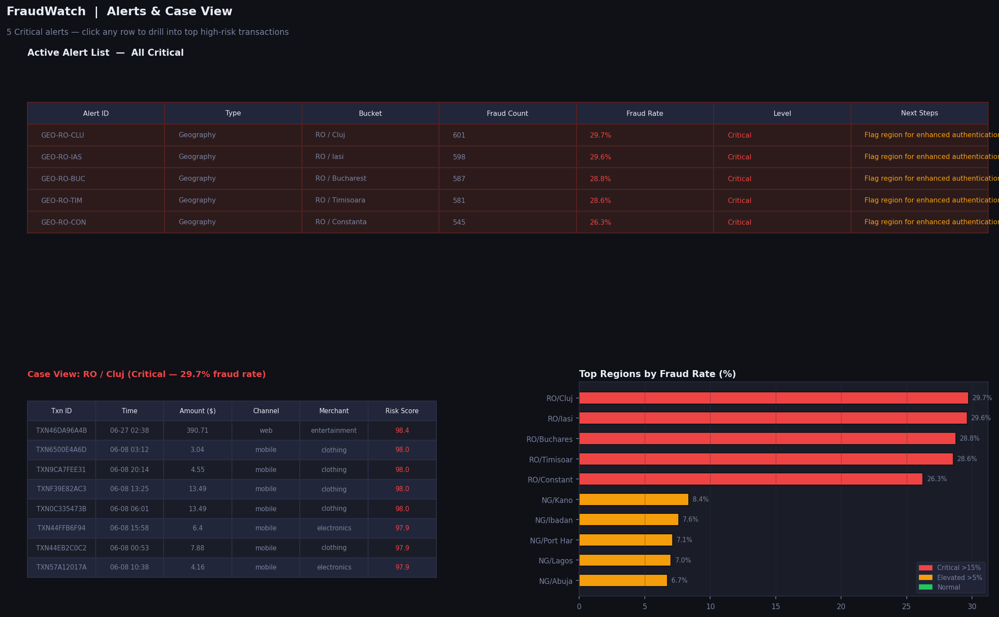

# Fraud Watch Dashboard

An end-to-end fraud monitoring dashboard for fintech risk teams, built with Python and Chart.js on top of 150,400 rows of synthetic transaction data spanning 5 channels, 10 countries, and 5 customer segments.

---

## Screenshots

### Overview: 30-day KPIs, fraud trend, and active alert summary

*Five KPI tiles surface total volume, fraud count, estimated loss ($4.05M), fraud rate (5.1%), and active critical alerts. The time-series chart shows three fraud waves as clear spikes on days 10, 18, and 24, each one tied to a distinct attack scenario.*

### Channel drill-down: fraud rate spike concentrated in mobile

*The mobile channel shows a sharp fraud spike on days 10-12, consistent with a Romanian card-testing bot wave. Call center carries the highest baseline fraud rate, driven by new-customer identity fraud. Each channel links to a drill-down view with transaction-level case data.*

### Alert list and case view: from anomaly to investigation in two clicks

*Five Critical alerts ranked by severity. Selecting one opens a Case View with the top 30 highest-risk transactions in that bucket: transaction ID, amount, merchant category, and risk score. Everything an analyst needs to act without leaving the dashboard.*

---

## Files

| File | Description |
|------|-------------|
| `fraud_watch_dashboard.html` | The dashboard itself. Self-contained, open it in any browser, no server needed. |
| `fraud_gen.py` | Generates the full 150,400-row synthetic dataset with the injected fraud patterns. |
| `FraudWatch_Business_Brief.docx` | An 8-page manager-friendly brief covering the problem, metrics, UX design, and where this could go next. |
| `requirements.txt` | Python dependencies for the data generation script. |

---

## Quick Start

**Step 1: install Python dependencies**
```bash
pip install -r requirements.txt
```

**Step 2: generate the dataset**
```bash
python fraud_gen.py
```
This produces `fraud_data_clean.json` (about 108 KB) with 150,400 transactions, pre-aggregated analytics tables, and the three injected fraud scenarios. Takes about 10 seconds to run.

**Step 3: open the dashboard**

Open `fraud_watch_dashboard.html` in any modern browser (Chrome, Firefox, Safari, Edge). No server, no build step. The JSON data is embedded directly in the HTML file.

---

## How a Risk Analyst Uses This

1. **Start on the Overview page.** Scan the KPI tiles for an unusual fraud rate or loss figure; the time-series chart makes anomaly spikes obvious without reading a report first.
2. **Check the Alert Summary table.** Pre-computed alerts rank channels, regions, and customer segments by severity (Normal / Elevated / Critical), so you know where to focus first.
3. **Drill into Channels.** Figure out which transaction channel is driving the spike, since mobile card-testing and call-center identity fraud need completely different responses.
4. **Switch to Geography.** The region hotspot table shows which cities or countries have an abnormal fraud concentration, so you can target step-up authentication or temporary blocks.
5. **Open the Segment view.** Compare fraud rates across new, regular, premium, high-value, and dormant customers. Dormant accounts run at 2.5x the baseline fraud rate and often signal mule-account activity.
6. **Click into Case View.** Any alert card opens a modal with the top 30 highest-risk transactions in that bucket, sorted by risk score, with everything you need to open an incident ticket or escalate to fraud ops.

---

## Dashboard Pages

| Page | Purpose |
|------|---------|
| **Overview** | 30-day KPI tiles, daily volume vs. fraud time-series, channel/segment breakdown, top alert summary |
| **Channels** | Fraud rate and volume per channel, daily stacked trend, sortable channel summary table |
| **Geography** | Country-level fraud count and rate charts, top-20 region hotspot table with case drill-down |
| **Segments** | Cohort daily trend, merchant category heatmap, segment KPI table |
| **Alerts** | Filterable alert cards (All / Critical / Geography / Channel / Segment) with one-click Case View modal |

---

## Injected Fraud Scenarios

### Scenario 1: Mobile card-testing (Romania, Jun 8-10)
About 2,800 micro-transactions of $1-$15, injected via the mobile channel across Romanian cities. Simulates a bot network probing stolen card numbers.
- **Signature:** high velocity, very small amounts, electronics/clothing merchants, shared device clusters
- **Investigation angle:** check device fingerprint clustering in Geography > Romania; velocity rules (over 10 txns/hour per card) catch 90%+ of this wave
- **Remediation:** temporary velocity cap on new Romanian mobile accounts, plus a CAPTCHA step-up for transactions under $20

### Scenario 2: High-value web fraud (UK / Germany, Jun 16-20)
About 1,400 transactions averaging $1,800+ via the web channel in the UK and Germany, concentrated in luxury, electronics, and travel merchants.
- **Signature:** large amounts, desktop device, premium/high-value segment, 3DS bypass patterns
- **Investigation angle:** sort Case View by amount descending, then cross-reference customer_ids against recent password-reset events
- **Remediation:** mandatory re-authentication for web purchases over $500 from IP addresses that don't match account history

### Scenario 3: New-customer call-center wave (Nigeria / Brazil / India, Jun 22-26)
About 1,200 fraudulent call-center transactions targeting newly onboarded customers, routed to crypto exchanges and travel bookings.
- **Signature:** new-segment customers, call_center channel, crypto_exchange/travel merchants, unknown device type
- **Investigation angle:** the Segments page shows a new-customer fraud rate spike on days 24-26; cross-reference with call-center agent IDs for social-engineering patterns
- **Remediation:** enhanced agent verification scripts, plus a 48-hour hold on crypto/travel disbursements for accounts under 30 days old

---

## Architecture

- **Data generation:** Python (pandas/numpy) produces the 150,400-row transaction dataset and pre-aggregates it into analytics tables (daily, by channel, by geography, by segment, by merchant category).
- **Anomaly detection:** rule-based heuristics compare the current fraud rate to a rolling 7-day baseline per channel/region/segment. Deviations over 3.5x baseline trigger Critical alerts, over 2x trigger Elevated.
- **Frontend:** vanilla JS plus Chart.js 4.4, reading pre-aggregated JSON embedded in the HTML. Five interactive pages sharing one case-view modal.
- **No backend required:** it's a static single-file HTML page, so you can email it, host it on GitHub Pages, or drop it into a Confluence wiki.
- **Risk score formula:** `risk_score = amount_weight + channel_risk_weight + geo_deviation + segment_multiplier + scenario_flag_bonus`, on a 0-100 scale. Weights are tuned so card-testing micro-transactions in high-risk geographies score 85+, and normal domestic transactions stay under 20.

---

## Data Model

| Field | Type | Risk Purpose |
|-------|------|-------------|
| `transaction_id` | string | Unique identifier for audit trails and incident tickets |
| `customer_id` | string | Links transactions to account history for velocity checks |
| `timestamp` | datetime | Enables time-window aggregation and spike detection |
| `amount` | decimal | Key signal: micro-amounts point to card-testing, large amounts point to account takeover fraud |
| `channel` | enum | Different fraud rates per channel; drives remediation strategy |
| `country / region` | string | Geographic clustering identifies organized fraud rings |
| `merchant_category` | string | Crypto/luxury/travel is high-risk, grocery/fuel is low-risk baseline |
| `device_type` | enum | `unknown` or device-type mismatches flag suspicious access patterns |
| `risk_score` | float 0-100 | Composite score combining amount, channel risk weight, geographic deviation, segment multiplier, and scenario flags; higher means more suspicious |
| `is_fraud_flag` | bool | Ground-truth label for metric calculation and future model backtesting |
| `customer_segment` | enum | New and dormant accounts carry a 2-2.5x higher fraud multiplier than regular customers |

---

## Future Extensions

- **Real-time streaming:** swap the embedded JSON for a WebSocket feed from Kafka/Flink to get sub-minute alert refresh.
- **ML model integration:** replace the heuristic alert rules with gradient-boosting or neural model scores. The `risk_score` field is already wired through the pipeline for this.
- **LLM case summaries:** auto-generate one-paragraph incident narratives from case view data, so analysts don't have to write them up by hand.
- **Graph analytics:** link `customer_id` and `device_type` in a graph database to surface connected fraud rings sharing device fingerprints across accounts.

---

## License

MIT
